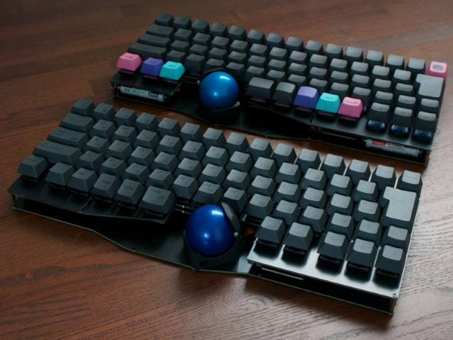

# GTRK67

GTRK67はトラックボール付き無線対応キーボードキットです。
日本語配列対応の67キー配列で、右手または左手の親指部分にトラックボールを搭載できます。
ダイオードやスイッチソケットは半田済みです。有線接続でのみ使用する場合は半田付けせずに組み立てられます。
ファームウェアはvial-qmkベースで、RemapやVialでキーマップや設定を変更できます。

単四電池を2本搭載することで無線接続もできます。ファームウェアやトラックボールは無線用にチューニングされており、低消費電力を実現しています。

***乾電池で動作させる場合は電池ボックスと電源スイッチのはんだ付けが必要です***

***仕様・外観などは予告なく変更される場合がありますのでご了承ください***

## 使用上のご注意

- 異臭や煙が出たときは、ただちに使用を中止して電源を切り電池を抜いてください
- 電池から漏れた液が目に入った場合は、失明する恐れがあるのですぐにきれいな水でよく洗い、医師の診断を受けてください
- 電池の+-を正しくセットしてください
- 使い切った電池は速やかに取り出してください
- 長期間使用しない場合は電池を取り出してください
- 電源が入った状態でトラックボールのセンサーの発光部を覗き込まないでください

## [ビルドガイド](./gtrk67-build-guide.md)
